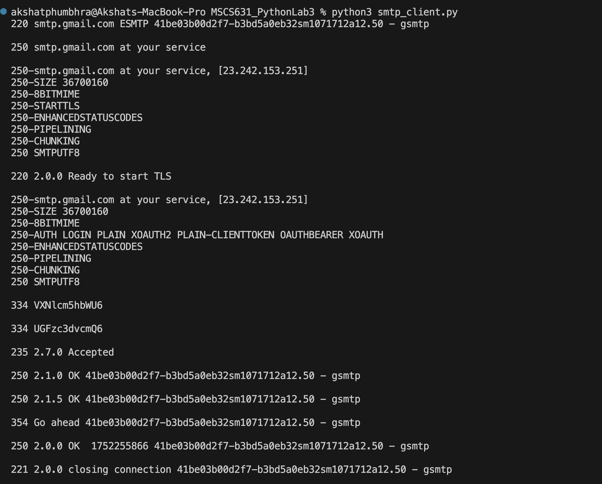
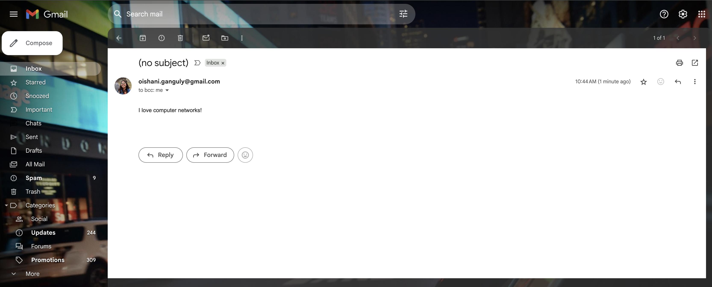

# Lab 3: SMTP Programming

### Oishani Ganguly

## Reflection on the Lab Experience

Working through this lab gave me hands-on insight into how the SMTP protocol operates “under the hood.” Building the client from raw sockets encouraged me to follow each step - 220 greetings, HELO handshakes, STARTTLS negotiation, AUTH LOGIN, and the DATA exchange - in precise sequence, which deepened my understanding of how modern mail servers secure and authenticate connections. Integrating environment-driven configuration and a secure password prompt also reinforced best practices for handling credentials. Overall, the exercise transformed what is often an opaque library call (smtplib.SMTP) into a clear, step-by-step workflow, strengthening both my socket programming skills and my appreciation for the layered security features that e-mail relies on today.

## Challenges Encountered

The most significant hurdle was navigating Gmail’s authentication requirements: after Google deprecated “less secure app” access, I had to generate and use an App Password, adjust environment variables, and ensure the TLS handshake wrapped correctly before issuing AUTH LOGIN. Getting the correct order of EHLO, STARTTLS, and the second EHLO over the encrypted channel took a few trial runs; missing or mistiming any of those commands resulted in 530 or 502 errors. Additionally, handling environment variables portably across macOS and ensuring no sensitive data was left in plaintext taught me the importance of secure configuration management in real-world network applications.

## Screenshots

### 1. SMTP Client Terminal Output

*SMTP client’s interaction with Gmail’s SMTP server: a successful 220 greeting, HELO handshake, STARTTLS negotiation, AUTH LOGIN exchange (with Base64-encoded credentials), and the MAIL FROM → RCPT TO → DATA → “I love computer networks!” submission, concluding with a 221 QUIT response.*

---

### 2. Gmail Inbox View of Received Message  
  
*Actual delivery of email in the Gmail web UI: the message “I love computer networks!” arriving in the recipient’s inbox (from the configured sender address), confirming end-to-end SMTP delivery.*